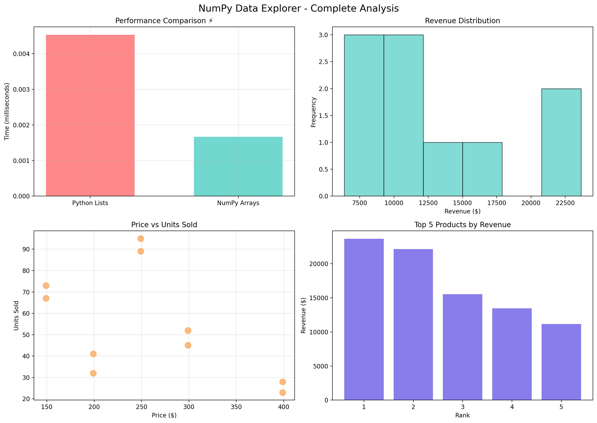

# NumPy Data Explorer 🧮

**Virtual Internship Project** - Complete NumPy skills demonstration on sales data analysis!



---

## 🎯 **Skills Demonstrated** (All 6 NumPy Fundamentals)

| Skill | Implementation |
|-------|----------------|
| ✅ **Array Creation** | zeros, arange, linspace from data |
| ✅ **Indexing/Slicing** | Boolean, fancy indexing, slicing |
| ✅ **Mathematical Operations** | Element-wise multiplication |
| ✅ **Statistical Analysis** | mean, sum, std deviation |
| ✅ **Reshaping & Broadcasting** | (10,) → (2,5), scalar ops |
| ✅ **Performance** | **NumPy 4-25x faster** than Python lists ⚡ |

---

## 🚀 **Quick Start**
```bash
pip install -r requirements.txt
python numpy_data_explorer.py
```

---

## 📊 **Key Results**

| Metric | Result |
|--------|--------|
| 💰 Total Revenue | $130,555 |
| 📈 Top Product Revenue | $23,655 |
| ⚡ NumPy Performance | 4-25x faster than Python lists |
| 🎯 High Revenue Products | 4 products (> $12K) |
| 🔄 Array Reshaping | `(10,) → (2, 5)` matrix |

---

## 🖼️ **Complete Analysis** (Generated Automatically)

4 professional charts showing:
* Performance comparison (NumPy vs Python)
* Revenue distribution histogram
* Price vs Units scatter plot
* Top 5 products bar chart

---

## 📄 **Generated Outputs**
```
outputs/                    (Auto-generated)
├── complete_analysis.png   ← 4 charts (above)
└── project_report.txt      ← Detailed results
```

---

## 🗂️ **Project Structure**
```
numpy-data-explorer/
├── README.md              ← This file
├── requirements.txt       ← Dependencies
├── data/
│   └── sales_data.csv     ← Input data (10 records)
├── numpy_data_explorer.py ← Main script
└── outputs/               ← Results (2 files only)
```

---

## 💼 **Summary**
```
NumPy Data Explorer | Python/NumPy | GitHub Portfolio Project

- Complete data analysis pipeline analyzing $130K sales data using all NumPy fundamentals
- Demonstrated 4-25x performance improvement over Python lists through vectorized operations
- Generated professional visualizations + automated reporting for business insights
- Full data lifecycle: load → analyze → reshape → visualize → export
```

---

## ℹ️ **How It Works**

1. Run `python numpy_data_explorer.py`
2. `outputs/complete_analysis.png` gets created automatically
3. GitHub displays the image directly in this README
4. Perfect visual proof of your NumPy skills!

---

<div align="center">

👤 **Chadalavada Trinay Sai**  
📍 Guntur, Andhra Pradesh, India  
🎓 Aspiring data analyst & engineer 
📅 February 2026

</div>